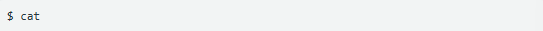

# Oblig 4 (Pensum)

## Prosesser i Linux
En prosess er et program som er aktiv på datamaskinen. Det vil si at programmets eksekverbare kode og data. 

## 1.1 Systemstart og pålogging
- Første prosess er systemd eller int. Den starter tjenester, logger og innloggingsprogrammer.
- Når du åpner en terminal og logger inn: bash (eller annet shell) startes som din prosess
- Fra shellet starter du nye prosesser ved å skrive kommandoer.

## 1.2 Forelder- og barneprosseser
- Nesten alt har en forelder **(PPID)**. Unntak: PID 1 (systemd)
- Hver kommando du kjører -> blir barn av shellet ditt.
- Dør forelderen først, blir barn adoptert av systemd (foreldreløse/orphans)
- **Zombie** = barn som er ferdig, men ikke "oppryddet" av forelder med wait().

## 1.3 PID og prosesstabell
- **PID** identifiserer prosesser unikt (kan gjenbrukes etter død prosess).
- En prosesstabell-post (C-struct) lager bl.ba. state, tidsbruk, eier, prioritet, åpne filer.
- Se detaljene i **/proc/<PID>/**
- **PPID** viser forelder; **TID** (thread id) for tråder.
- **Nice/PRIO** påvirker planlegging (hvem får CPU først)

## 1.4 ps
- For å se hele eller deler av porsesstabellen, kan vi bruke Linux-kommandoen **ps**.
- **Ps** gir et "snapshot" av prosessene på systemet.
- Hvis du du gir kommandoen ps i shellet uten oprasjon, vil den bare gi informasjonen om prosessen som kjører i shellet *bash*.

##### Eks:
| PID | TTY | TIME | CMD |
|-----|-----|------|-----|
| 3349 | pts/0 | 00:00:12 | bash |
| 11215 | pts/0 | 00:02:33 | emacs |
| 22756 | pts/0 | 00:00:00 | ps |

- **PID** angir prosess-ID
- **TTY** viser til en systemfil som representerer terminalvinduet som prosessen kjører i. Det vil her stå **?**
- **TIME** er CPU-tiden som prosessen har brukt til nå, siden den ble startet på systemet.
-**CMD** er navnet på kommandoen, eller det eksekverbare programmet som kjører.
- For å se den prosessinformasjonen i langt format, kan du legge til -l (long)
- Den andre kolommen **S** er en bokstav som angir status. R: running, ": waiting, S: sleeping, Z: zombie.
- Kolonnen "**UID"** angir **userID** til brukeren som eier prosessen. Hver bruker på et Linux-system har både ett brukernavn og en unik bruker_ID som er et heltall.

## 1.5 Forgrunns- og bakgrunnsprosesser
- Når du starter et programm i shellet, kan du velge om prosessen skal kjøre som en **forgrunnsprosess** eller en **bakgrunnsprosess**
- ### Forgrunnsprosess:
    - Det er standardmåten å kjøre en prosess på i shellet, som brukes når du bare avslutter kommandoen som gis med å taste *return*.
    - Fks vil denne komandoen starte programmet `cat` som en forgrunnsprosess. 
    
    - Prosessen som kjører "*cat*" vil da lese input fra standard innenhet (stdin), som i utganspunktet er tastaturet.
    - Utskrift fra prosesse går til standrad utenhet (stdout), som er skjermen.

- ### Bakgrunnsprosess
    - Hvis du skal kjøre et programm som ikke trenger input fra tastatur/bruker, kan du starte det som en brakgrunnsprosess.
    - Dette gjøres ved å gi tegnet `&` (ampersand) på komadolinjen.
