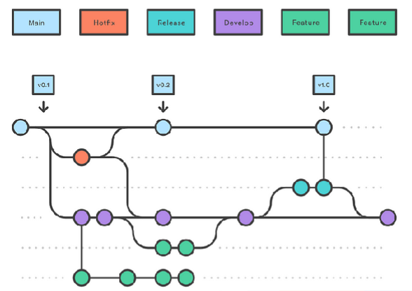
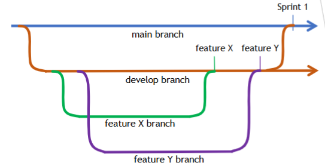

# Uke 38
## Git-funksnjonalitet

- En branch er en prarrell versjon av repoet.
    - Kan være en remote eller lokal
    - Fordelaktig for at utviklere skal kunne jobbe samtidig og trygt

- master/main branch
    - Opprettes samtidig som repo-et og representerer hovedversjonen
    - Navn kan variere

## Git-funksjonalitet - merge
 - Selv om branches er nyttige øsnsker vi til slutt et produkt samlet på en branch
 - Vi må på et vs slå sammen funksjonalitet utviklet på forskjellige branches
    - Dette kalles mergin
    - I praksi: En base-branch pull-er en annen branch i seg.
- Det finnes flere typer mergin
    - Merge
    - Fast forward margin
    - Squash mergin

- Merge - setter sammen commits i en branch med en annen basert på tidspuknt.
    - Endringen slås egt sammen smatidig en en merge-commit.
- Fordeler
    - Beholder alle commits
    - Beholder tidspunkt av endringer
    - Beholder informasjon om branches
- Ulemper
    - Kan føre til rotete og uoverskiktlig historikk.

## Git funkjonalitet - Fast forward mergin
- Hvis base-branchen ikke har blir oppdatert i mellomtiden kan branch-comittene legges på slutten av main uten en merge commit.
    - Kalles fast forward merge og gjøres ofte automatisk hvis mulig.
- Fordeler
    - Beholder commits
    - Viser commits som om de har blitt gjort direkte i base-branchen

## Git funksjonalitet - Squash merge
- Squash merge - Slår sammen commitene i en branch til en commit og merger denne commiten til base-branch

- Fordeler
    - Luker vekk små-commits og fører til en mere oversiktlig historie
    - Samler mer overordnet arbeid i en commit.
- Ulemper
    - Mister individuelle commits og dermed også muligheten til å se/revertere til mer spsifikke tidspunkter.
- Kan også selektiv squashe enkelte konseptuelle små commits.

## Gir funkjonalitet - Rebase and Merge
- Rebase and Merge-  Tar commitene i en branch og legger dem på slutten av base-branch uavhengig av tidspunkt.
- Fordeler
    - Historikken blir ofte mer intuitiv, hvor feature-commits blir ryddig lagt til etter hverandre.
    - Beholder alle commits

## Git funskjonalitet - Merge conflicts
- Når man merger kan det oppstå konflikter
    - Typisk overlappende endriger. F.eks. at begge har endret på en methode
- I slike tilfelle må vi manuelt bestemme hvordan konflikten skal løses:
    - Velge en av endrigene som skal beholdes.
    - Beholde begge endringene
    - Manuet går inn og skrive om til en ny og bedre løsning.
- Løses typisk lokalt.

## Git funskjonalitet - Reset
- Hvis man merker at man har gjort noe feil kan man benytte reset, for å tilbakesette versjonen.
    - Typisk lokalt.
    - Vær forsiktig med å dytte effekter av reset til remote-repo!
        - Krever force push. "Forkast alt som er annerledes i denne versjonen"
- Tre varianter
    - **Soft** - Vansklig å forstå. Beholder andringer, men resetter HEad til denne comitten.
        - Ikke bruk denne....
    - **Mixed** - Alle ednringer etter dette blir ikke-commitede endringer
    - **Hard** - Alle endringer etter dette forkastes.

## Git-funksjonalitet _ Anbefaling til Mergin
- Bruk hovedsaklig vanlig mergin
    - Unngå fast forward hvis mulig.
    - Unngå rebasing!
    - Squashing kan gjøres for små commits, men hlest ikke for hele features. 

- Ved merge-konflikter
    - Løs lokalt og bekreft at løsningen er god.
    - Hvis noe blir feil, reset til før merge og gjør det på nytt.

## Git-funksjonalitet - .gitignore
- Gitignore er en fil som spsifiserer en liste med filer i lokal repos som aldri skal commites eller pushes
    - Git ignorerer disse fullstendig.

- Nyttig for slikt som
    - Filer generert fra kode.
    - Temp-filer under kjøring
    - Personlige IDE konfigurasjoner
- Ekstra viktig for HEMMELIGHETER (passord, lryptografiske nøkler, osv.)
    - Egentlig best å hodntere denne utenfor miljøet.
        - Sette inn fra miljøet rundt aplikasjonen.
        - En egenconfig-fil som ignorers
        - Et eget

## Forking
- En fork er en komplett, men selvstendig versjon av et eksisterende prosjekt.
    - I praksis at vi kopierer et eksisterende public prosjekt i vårt eget repo.
    - "Forken" beholder fullstendig historikk
- Vanlig for at utviklere som ikke har direkte tilgang skal kunne jobbe på prosjektet (privat eller komme med forslag)
- Skjer også ofte med open source-prosjekter.

## Gitt funksjonalitet - Pull requests
- En pull request er et forslag til endringer
    - Endringene blir gjort på egen branch (i prsosjektet eller i en fork)
    - Endringene forsøkes å pulles (merges) inn i hovedbranchen men må godkjennes av prosjekteier(e)
        - Altså begrepet pull reqest.
        - Gjøres typisk gjennom git-hosting-tjenesten

## Anbefalt arbeidsformat (Team)
- Del opp  branches
    - Main
        - Oppdateres hver sprint/innlevering
    - Develop
        - Inneholder alle nyeste features
        - Merges til main mot slutten av hver sprint
- Hver srpint
    - Oppdater backlog
    - Utviklere velger / fordeler features og lager sine egne branches fra develop
    - Merge feature-branches inn i develop når de er ferdige.
    

## Anbefalt Arbeidsfly
- Velg en feature/oppgave fra backlog-en
- Lag en ny branch og oppkall den etter feature-en
- Jobb på feature branchen
    - **Commit ofte** - Kan være en ide å navngi etter featureen
    - Hvis develop opppdaterer seg betydlig i mellomtiden - MERGE develop inn i feature-branchen