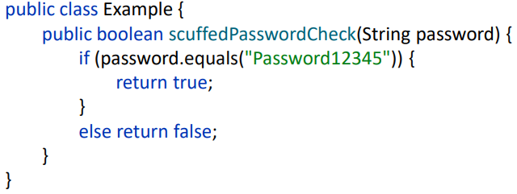
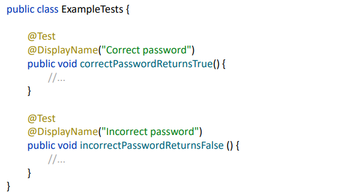
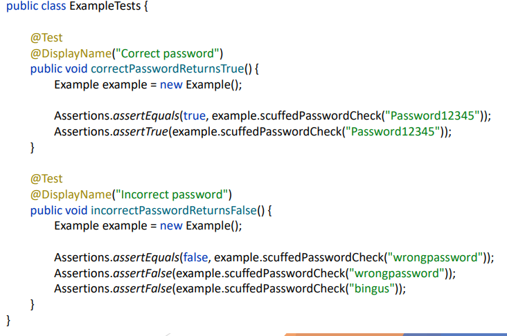
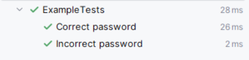

# Uke 39 - Enhetstesting

## Hva er egentlig testing i software engineering

- Dette er en oversikt over fire "kategorier" av testing i Software Engineering
- Funksjonell testing
    - Teste (kode) funksjonalitet for å finne bugs og sjekke/bevise at ting fungerer som tiltenkt.
- Brukertesting
    - Teste produktet med brukere for å finne ut av hvor nyttig og behagelig produktet er å bruke.
- Ytelsestesting
    - Teste om produktet er raskt nok og tåler belastning.
- Sikkerhetstesting
    - Teste at produktet ikke kan misbrukes for uønskede effekter (mot leverandør og/eller brukere)
- +Akseptansetesting
    - Evaluere opp mot kravspesifikasjon
    - Involverer ofte mange eller alle av de fire kategoriene.

## Avgrensning av testing i kurset

- Vi skal hovedsakelig forholde oss til funksjonell testing og akseptansetesting i dette kurset
    - Funksjonell testing kan gjøres forholdsvis enkelt og kan/skal gjøres under utvikling av produktkode.
    - Brukertesting krever å teste med brukere. Nyttig, men kan bli mye overhead.
    - Ytelsestesting er viktig når man faktisk skal selge et produkt. Det forventes ikke av dere.
    - Sikkerhetstesting: Større fokus i kurs som Datasikkerhet i Utvikling og drift.

## Funksjonell testing
- Typer funkjonalitet i et produkt
    - Fullstendig produkt -> "Features" som sammen utgjør produktet -> Units/enheter som sammen utgjør en feature. 
- Unit/enhet - En (typisk liten) bit med kode som har en klar oppgave
    - Klasse / Metode
- Enheten er typisk...
    - Input -> Logikk -> Output/Resultat.

- Typer funksjonell testing
    - Enhetstesting - Teste at hver enhet i isolasjon fungerer som tiltenkt.
    - Integrasjonstesting - Teste at enheter fungerer når de jobber sammen
        - Kalles feature-testing hvis enhetene utgjør en hel feature
    - Systemtesting - Teste produktets features fungerer sammen som forventet
    - Release testing - Teste at produktet fungerer i tiltenkte bruksmiljøer (f.eks. på forskjellige datamaskiner)
    
## Enhetstesting
- Vårt fokus vil ligge mest på Enhetstesting
    - Og litt integrasjonstesting
- Hva er egentlig en enhet?
    - Typisk en funksjon / metode
        - Kan også være en gruppe funksjoner/metoder eller en klasse
- Har bare en oppgave - Kan ikke bryte ned mer
    - Er ikke egentlig en "enhet" dersom den kommuniserer med noe "variabelt" og utenfor seg selv
         - Filsystem, database, nettverk osv.
- Enhetstesting - Vi sjekker at forskjellige inputs gir de forskjellige resultatene vi forventer

## Enhetstesting - Equivalence partitions
- For å sjekke at enheter fungerer som forventet må vi teste med et gjennomtenkt utvalg inputs.
    - Begrepet "Equivalence partitions"
- Vi bør teste for...
    - Et variert utvalg av riktige inputs (normalt bruk)
        - Bekrefter at det "fungerer som det skal"
    - Et utvalg av inputs som kan føre til feil eller som ikke skal aksepteres (unormalt bruk)
        - Kontrollere at unormalt/uakseptabelt bruk blir håndtert
- Det er ikke mulig eller fornuftig å teste alle kombinasjoner

## Enhetstesting - Gode retningslinjer
- Test edge cases:
    - If your functions has upper and lower bounds (e.g. length of strings, numbers etc.)
- Force errors
    - Choose test inputs that force the system to generate all error messages. Choose test inputs that should generate invalid outputs.
- Fill buffers
    - Choose test input that cause all input to overflow.
- Overflow and underflow
    - If your program does numeric calculations, choose test inputs that cause it to calculate very large or very small numbers.
- Don't forget null and zero
- Keep count
- One is different. 

## Lage enhetstester
- Hver enhetstest er en bit med kjørbar kode definert av enhvert utvikler
- En enhetstest er basert på å sammenligne to verdier (Er de like?)
    - Den ene verdien er resultatet av enhetens kjøring
    - Den andre er verdien at utvikleren forventer at programmet skal kjøre
- Verdisammenligninger gjør feilsøking ganske enkelt
    - Hvis like verdier -> Yippi! Enheten fungerer!
    - Hvis ulike verdier -> Ok, noe er feil med enheten og må fikses.
    - En enhet er typisk bare noen få linjer med kode
    - Vi kan typisk også se nøyaktig hvilken input som medbringer feilen.
- Merk: En enhetstest må være deterministisk for å være nyttig (Samme input gir alltid samme resultat)
    - Hvis ikke er det vanskelig å feilsøke...
    - Hvis det som testes er basert på noe tilfeldig/uforutsigbart, må dette gjøres statisk i testen.

## Enhetstester - Rammeverk
- Testrammeverk følger typisk ikke med i programmeringsspråket som standard og må legges til i prosjektet
- Java - JUnit
- Python - PyTest
- .NET - NUnit
- TypeScript - Jest

- Dere står frie til å velge språk/rammeverk i prosjektet.

## JUnit - Oppsett av prosjekt
- Krever et byggevektøy
- Gitt denne enheten for passordsjekking
    - Hva burde vi teste? 

- 2 ting...
    - Passord er lik -> True
    - Passord er ikke lik -> False
- Vi lager en test-klasse med ett tilsvarende navn som den originale
    - Under test/java/
- En gitt test er definert som en vanlig metode
    - Annotert med @Test
    - Navnet på metoden er valgfritt, men det kan være lurt å navngi etter hva som skal testes.
    - DisplayName() er også valgfritt men det hjelper for oversikt i kjøreresultater, samt lesbarhet av kode.

- Tester defineres av "Assertions"
    - Sammenligning av verdier.
    - Assertions.assertEquals() sjekker at to verdier er like
        - Første parameter representerer det som er forventet.
        - Andre parameter er det faktiske resultatet.

### Slik ser resultatet ut etterpå:

## Arrange, act, assert
- Når vi skriver tester er det fordelaktig å følge en struktur

- Det er lov til å gjøre Act OG Assert samtidig så lenge det forblir oversiktlig.

## Arrange, act, assert
- Når vi skariver tester er der fordelaktig å følge  en strukur

- Det er lov til å gjøre Act OG Assert samtidig så lenge det forblir oversiktlig.

## Junit- SKrive enhetstester
- Lag en unik test for hver equivalence partion.
    - Fordi: mange urelaterte assertions gjør det vanskelig å se hva som fakrisk passer/feiler
    